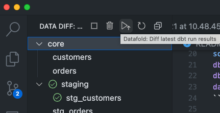
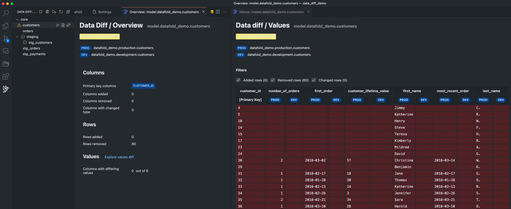

# Datafold VSCode Extension Demo: Data Diffs

This is a demo for how to use the [Datafold VSCode Extension](https://marketplace.visualstudio.com/items?itemName=Datafold.datafold-vscode&ssr=false#overview) to compare data between your development and production environments with [dbt](https://www.getdbt.com/).

Our team at [Datafold](https://datafold.com/) built this extension to help data teams move faster and with more confidence when shipping data. We hope you find it useful!

## Let's get started!

Copy and paste the below in your terminal to get started with this demo in a single motion.

```shell
git clone https://github.com/datafold/data_diff_demo.git # clone this repo
cd data_diff_demo # change into the repo directory
python3 -m venv venv # setup your virtual environment
source venv/bin/activate # activate it
python3 -m pip install --upgrade pip # upgrade pip
python3 -m pip install -r requirements.txt # install dbt and data-diff
source venv/bin/activate # reactivate virtual environment
dbt build # build development datasets
dbt build --target prod # build production datasets
data-diff --dbt # run data-diff CLI to compare development and production datasets
```

Your terminal should look like this:


Install the VSCode Extension


Update Settings for the VSCode Extension


Set your specific settings for the VSCode Extension
> Note: set absolute paths to avoid any issues
> Your paths will be different than mine and will likely look like the below

dbt Profiles Directory: `/Users/<your name>/data_diff_demo`

dbt Project Directory: `/Users/<your name>/data_diff_demo`

Python Path: `/Users/<your name>/data_diff_demo/venv/bin/python3`


Change a model like `customers.sql` and run in your terminal: `dbt build`

Run Data Diff through the Datafold Extension



View the results!
